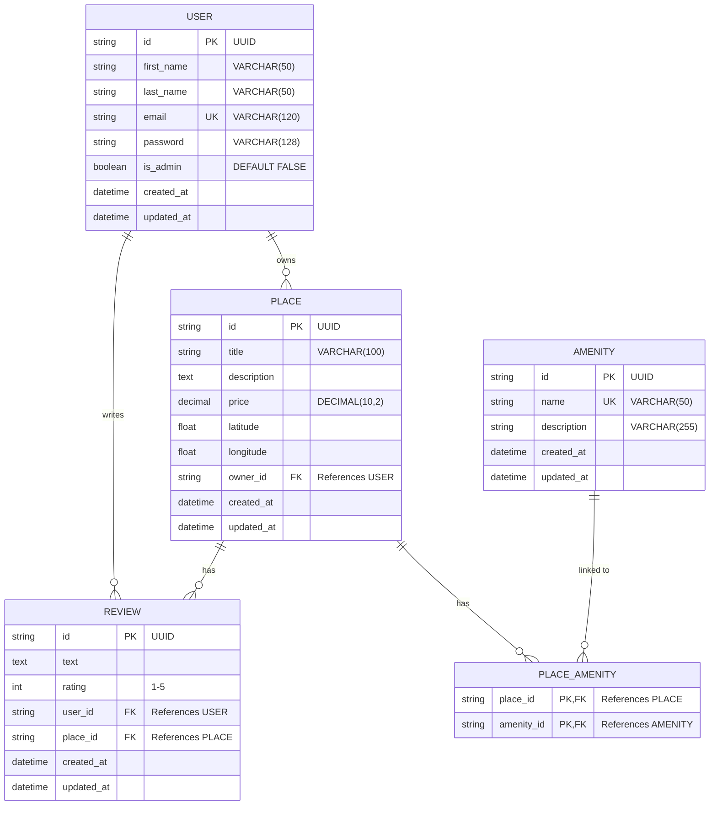

# HBnB Database ER Diagram

This document contains the Entity-Relationship diagram for the HBnB database schema.

## Relationships

### One-to-Many Relationships

1. **User to Place**: A User can own many Places, but each Place belongs to exactly one User (owner).
2. **User to Review**: A User can write many Reviews, but each Review is written by exactly one User.
3. **Place to Review**: A Place can have many Reviews, but each Review is for exactly one Place.

### Many-to-Many Relationships

1. **Place to Amenity**: A Place can have many Amenities, and an Amenity can be associated with many Places. This is implemented through the `place_amenity` association table.

## Constraints

- **Unique Email**: Each user must have a unique email address.
- **Unique Amenity Name**: Each amenity must have a unique name.
- **One Review per User per Place**: A user can only leave one review for each place (enforced by unique constraint on `user_id` + `place_id`).
- **Rating Range**: Reviews must have a rating between 1 and 5.
- **Users Cannot Review Own Places**: Users cannot create a review for a place they own.

## Foreign Key Relationships

| Table | Column | References |
|-------|--------|------------|
| places | owner_id | users(id) |
| reviews | user_id | users(id) |
| reviews | place_id | places(id) |
| place_amenity | place_id | places(id) |
| place_amenity | amenity_id | amenities(id) |
